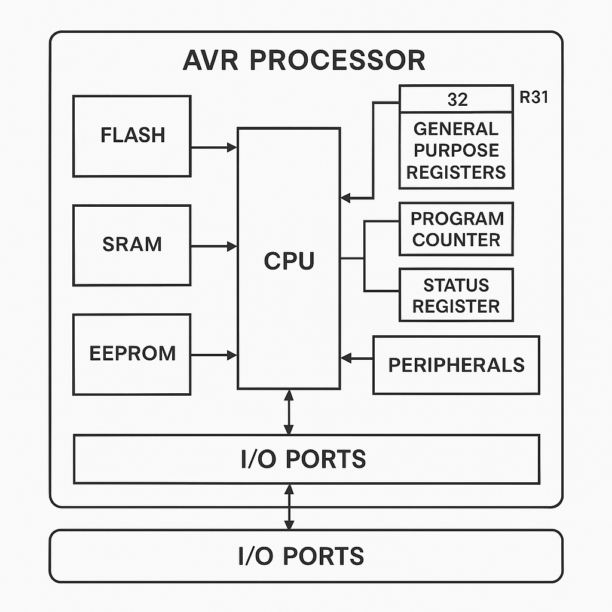

# Arduino and AVR

We won’t dive into the mysteries of electronics — no transistors, resistors, gates, or logic circuits today.
We’ll treat all that as given and jump straight into the fun part: how a processor works.

An AVR processor is a type of microcontroller—a tiny computer on a single chip—commonly used in electronics, 
embedded systems, and hobbyist projects like those involving Arduino boards.
AVR was originally developed by Atmel (now part of Microchip Technology) and is known for being fast, efficient, 
and easy to program in C or assembly language. Unlike a full computer, an AVR microcontroller is designed to 
perform specific tasks, like controlling the lights in your home or reading data from a sensor.

The ATmega328P is an 8-bit microcontroller and uses a modified Harvard architecture, 
which means it has separate memories and buses for program and data.
This allows for simultaneous access and enables faster, more efficient processing.

At its core, the AVR processor is built around a CPU (central processing unit) and is connected to:
- Flash memory (to store the program)
- SRAM (for working memory)
- EEPROM (for permanent data storage)
- I/O ports (to interact with the outside world, like turning LEDs on/off)

Key features:
- 8-bit RISC architecture (Reduced Instruction Set Computer).
- 32 general-purpose working registers.
- Around 130 Opcodes (Instructions)
- Single-level pipeline (single core).
- Operating clock frequency is typically 16 MHz.

The CPU executes instructions stored in memory—one at a time. 
These instructions can perform simple tasks like adding two numbers, copying data, or checking if two values are equal.

### Schematic

### Registers

Registers are like super-fast, tiny storage units inside the CPU. Think of them as the CPU's scratchpad.
AVR processors use a set of 32 general-purpose registers labeled R0 through R31. These are used to:
- Store temporary data
- Perform calculations
- Pass values between instructions

### Special Registers

In addition to general-purpose registers, AVR also includes special-purpose registers, such as:
- Program Counter (PC): Keeps track of which instruction is currently being executed.
- Status Register (SREG): Stores information about the result of operations (e.g., if the result was zero or if there was an overflow).
- Stack Pointer (SP): Keeps track of the call stack, used in function calls and interrupts.

These special registers help control the flow of your program and enable features like interrupts, loops, 
and decision making.

### Input / Output

AVR microcontrollers often come with built-in peripherals such as:
- Timers and Counters
- Analog-to-Digital Converters (ADC)
- Serial Communication Interfaces (like UART, SPI, I2C).
  These are controlled by memory-mapped I/O registers—special addresses in memory that interact with external devices. 
  For example, writing a value to the PORTB register can set the pins of Port B to HIGH or LOW, turning LEDs on or off.

Now, let's look deeper into [instructions](/arduino/avr/instruction-basics) and how a program is executed on a AVR.
