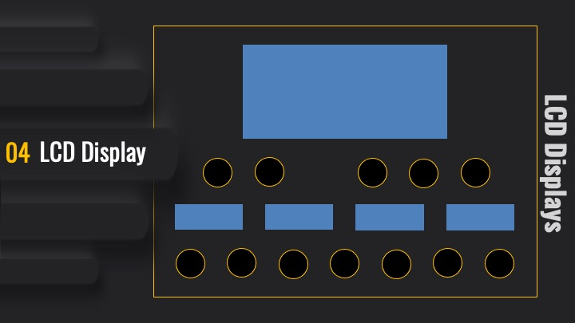

# Components

In the previous chapters we discussed Arduino programming, I²C and LCDs. 
The DIY-MIDI-Music-Workstation-Pedal-Board uses four 2004 LCD Displays (20 characters, 4 rows) which
offers plenty of room to display information even in bad lighting conditions. We can use 4 Rows or use BigChar 
techniques to show characters spanning two, three, or even four rows. It is time to turn the breadboard hardware into
a reusable component. 

## Component Diagram

A component diagram (see [UML](design/uml)) breaks down the actual system under development into various high levels of functionality. 
Each component is responsible for one clear aim within the entire system and only interacts with other essential 
elements on a [need-to-know basis](https://www.visual-paradigm.com/guide/uml-unified-modeling-language/what-is-component-diagram/).
