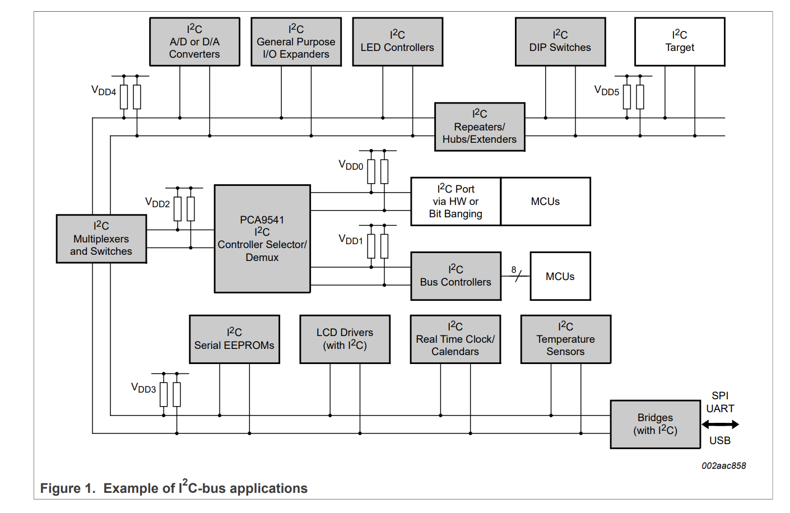

# Arduino and I²C

I²C, short for Inter-Integrated Circuit, is a serial communication protocol that allows multiple devices 
to communicate using just two wires — one for data (SDA) and one for clock (SCL). Originally developed by Philips 
(now NXP), I²C has become a widely adopted standard in embedded systems for connecting low-speed peripherals 
such as sensors, LCD displays, EEPROMs, and more to a microcontroller (see: diagram from NXP)

We will discuss hardware related topics of I²C in the [electronics section](/electronics/i2c), 
while the Arduino section focuses on the software side, showing how to develop code and communicate with I²C devices effectively.
If you are interested in details download the [official spec](https://www.nxp.com/docs/en/user-guide/UM10204.pdf).

Now, let's uncover [I²C on a Arduino](/arduino/i2c/i2c-basics). 

