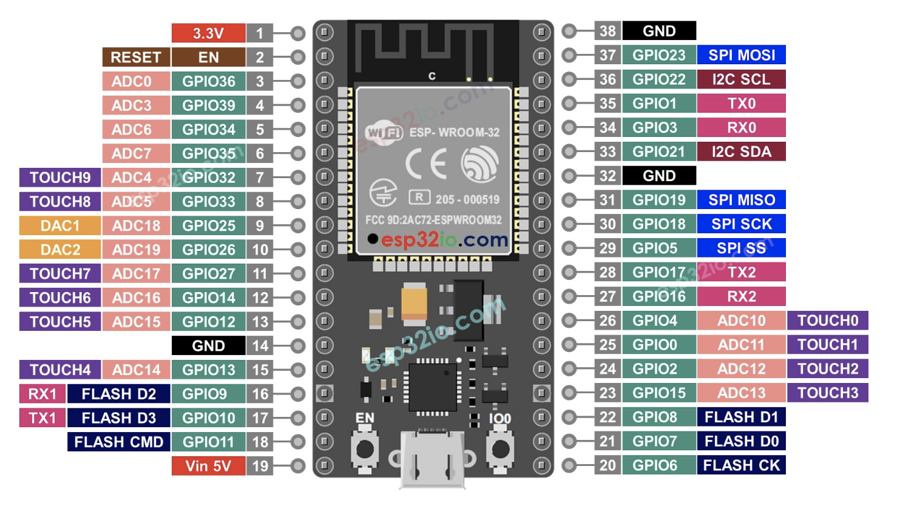

# Electronics

Now lets make our hands dirty and dive into the world of electronics and microcontrollers, again thinking in components
and how to use a micro controller to read buttons, send button state, control lights and MIDI IN/OUT.

## What Is a Microcontroller?

A microcontroller (MCU) is a small, self-contained computer built into a single chip. It includes:
One or more CPU cores, RAM and program memory (like Flash or ROM), Programmable I/O interfaces.
Unlike general-purpose microprocessors, which require multiple separate chips for memory and I/O,
microcontrollers are designed for embedded applications — compact, cost-effective systems that control specific tasks.
While less powerful than a System on a Chip (SoC), a microcontroller may still be part of one.
SoCs typically integrate more advanced components like Wi-Fi, GPUs, or coprocessors.
Microcontrollers are found in countless devices — from car engines and medical implants to toys, appliances,
and IoT edge devices. Their low cost, small size, and ability to handle both digital and analog signals make
them ideal for controlling real-world systems efficiently.

## Pin Out

Let's have a quick look at the ESP32 Pin Out (https://esp32io.com/):

A typical microcontroller comes with around 38 pins (for example, 2 × 19).
But not all of them are free to use — some are reserved for dedicated functions.
Here’s a quick breakdown of what these pins can do:
- Power Supply Pins 
  5V / 3.3V — Provide regulated voltage to power components 
  GND — Ground reference for the entire circuit 
- Communication Interfaces 
  I²C (SCL / SDA) — Serial bus for connecting sensors and peripherals 
  SPI (MOSI / MISO / SCK / SS) — High-speed full-duplex communication 
  TX / RX — UART serial transmission and receiving 
- Analog-Digital Converter (ADC) 
  ADC pins measure analog voltage levels (e.g. 0–3.3V) 
  Values are mapped to a numeric range, commonly 0–255 or 0–1023, depending on resolution. 
  This is useful for reading sensors like potentiometers, temperature sensors, or light levels. 
- Digital Output & PWM 
  Some pins support PWM (Pulse Width Modulation) — great for dimming LEDs or simulating analog signals. 
  Others may allow Digital-to-Analog Conversion (DAC) in the opposite direction
- GPIO — General Purpose I/O 
  GPIO pins can either output voltage (e.g. 0V or 5V) or read logic levels (true/false) 
  They’re the basic interface for buttons, LEDs, relays, and much more 
  Think of them as programmable switches — simple but powerful. 

Now that we’ve seen just how powerful and versatile microcontrollers can be,
it’s time to roll up our sleeves and dive into the real stuff — the kind of features that bring our DIY pedal board
to life.

## And now?

In the next sections, we’ll explore:
- [USB: how to detect, connect, and communicate with our main brain device](/electronics/USB).
- [MIDI I/O: sending, receiving, filtering, and transforming MIDI messages](/electronics/MIDI_IO).
- [I²C: communicating with displays, sensors, and other low-speed peripherals](/electronics/I2C).
- [GPIO: connect our button matrix](/electronics/GPIO_button_matrix).
- [RGB LED control: from subtle status indicators to full-on stage light effects](/electronics/RGB_LED).

Each topic will come with practical examples, code insights, and real hardware use cases — because blinking LEDs are fun,
but controlling a rig like a pro is even better.

