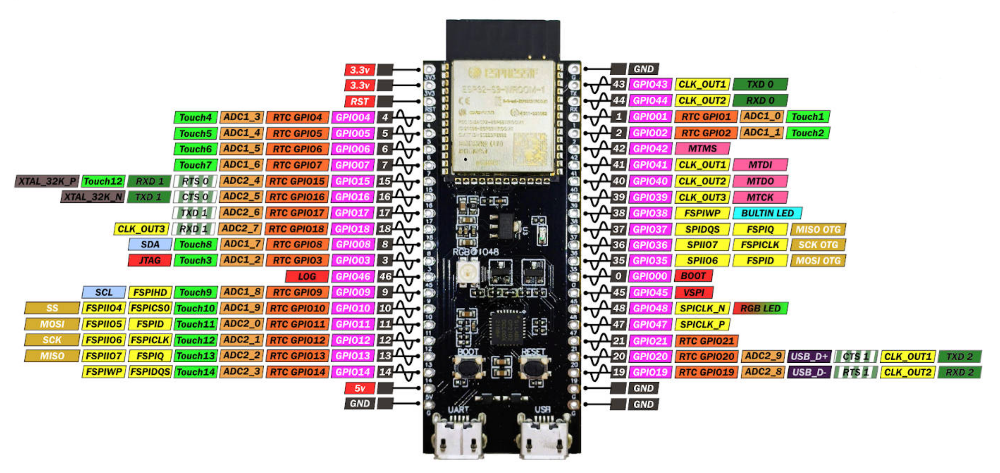
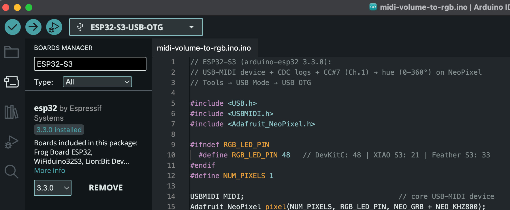
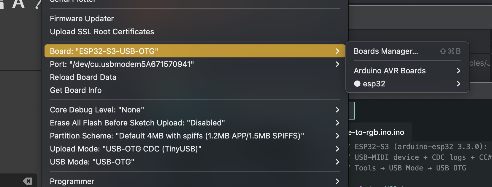

# ESP32-S3

While playing with [Arduino Nano](/arduino) is fun, the ESP32 packs far more performance, memory, 
and built-in connectivity into a small and affordable package, making it better suited for modern, connected, 
and computationally demanding projects than the Arduino Nano.

The ESP32 is generally considered superior to the Arduino Nano for several reasons:
- Processing Power & Memory: The ESP32 has a dual-core 32-bit processor (up to 240 MHz) compared to the Nano’s 
  8-bit AVR microcontroller (16 MHz), along with far more SRAM and flash memory.
  This means it can handle more complex programs and multitasking.
- Connectivity: ESP32 has built-in Wi-Fi and Bluetooth (Classic + BLE), making it ideal for IoT and wireless projects 
  without needing extra modules, whereas the Nano has no native wireless capability. And most interestingly, the
  ESP32-S3 has two USB ports, one for uploading firmware and serial communication (logs) and an USB2GO port, which
  allows it to behave as MIDI class compliant device.
- Peripheral Support: It offers more I/O pins, multiple ADC channels with higher resolution, touch sensors, 
  DACs, hardware PWM, and better timers, providing greater flexibility for diverse applications.

## Setup

We use the Arduino IDE too. If this is not already installed and running see the [Arduino section first](/arduino#setup).
To make use of the ESP Toolchain we have to install the ESP artifacts: 

Click on library icon, search for ESP32-S3 and install it.

Finally, verify that your communication settings (port, board type, and speed) are correct — and you’re ready to go!

## Shift gear!

With our ESP32-S3 environment ready, we can start with a [program](/esp32/midi-class-compliance) that transforms this little 5 € microcontroller 
into a fully functional, MIDI class-compliant device. It will listen on all MIDI channels for volume change messages 
and instantly reflect the new value by updating the onboard RGB LED. But calm down, first we think about simulating
a MIDI transmitter device by the help of [JavaFX](/esp32/simulation-midi) 