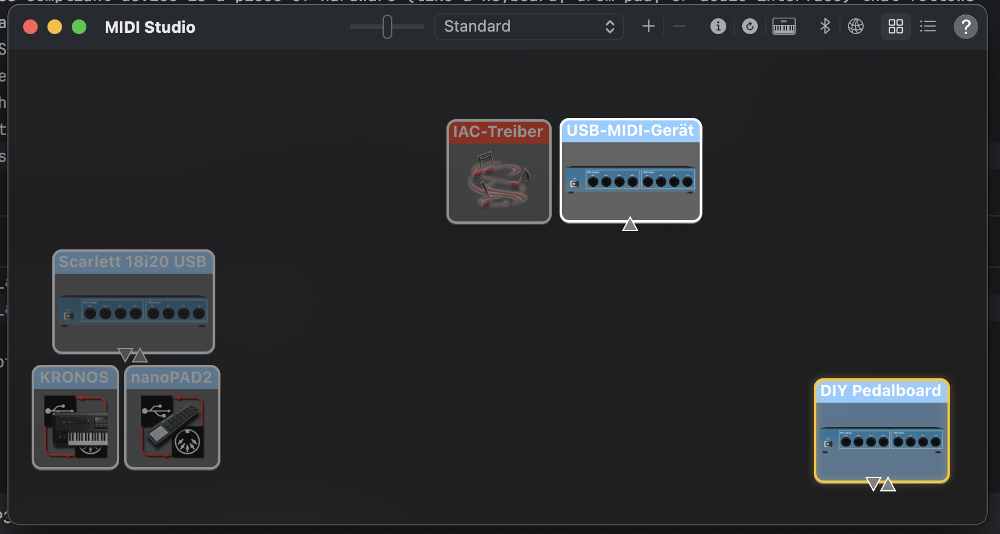

# ESP32 

todo: picture, two USB cables

## MIDI class compliant

A MIDI class compliant device is a piece of hardware (like a keyboard, drum pad, or audio interface) that follows 
the official USB MIDI device class specification. When a device is “class compliant,” it means it adheres to a 
standard USB protocol defined by the USB Implementers Forum. For MIDI class compliant devices, 
it uses the USB MIDI device class specification so that it can communicate with computers, tablets, 
and smartphones without needing special drivers. If the device is truly class compliant, 
your operating system (Windows, macOS, Linux, iOS, Android) will recognize it automatically 
and use its built-in MIDI driver.

Sneak Preview: On MacOSX simpy start `Audio Midi Setup` and select `Menu --> Midi Studio --> Refresh Midi Setup` 
And voilá here is our `DIY Pedalboard`: Working! Now lets dive in how we got there.  

## Midi Receiver

Lets create a MIDI receiver which registers as MIDI-class-compliant device and receives Midi Volume Messages from 
our [simulator](/esp32/simulation-midi/)

The following program was mainly written by ChatGPT

    // ESP32-S3 (arduino-esp32 3.3.0):
    // USB-MIDI device + CDC logs + CC#7 (Ch.1) → hue (0–360°) on NeoPixel
    // Tools → USB Mode → USB OTG
    
    #include <USB.h>
    #include <USBMIDI.h>
    #include <Adafruit_NeoPixel.h>
    
    #ifndef RGB_LED_PIN
    #define RGB_LED_PIN 48   // DevKitC: 48 | XIAO S3: 21 | Feather S3: 33
    #endif
    #define NUM_PIXELS 1
    
    USBMIDI MIDI;                                     // core USB-MIDI device
    Adafruit_NeoPixel pixel(NUM_PIXELS, RGB_LED_PIN, NEO_GRB + NEO_KHZ800);
    
    // ---- tiny helper: HSV (0..360,0..1,0..1) → RGB(0..255) ----
    static void hsv2rgb(uint16_t h, float s, float v, uint8_t &r, uint8_t &g, uint8_t &b)
    {
        h = (h % 360);
        float C = v * s;
        float X = C * (1 - fabsf(fmodf(h / 60.0f, 2) - 1));
        float m = v - C;
        float r1=0,g1=0,b1=0;
        if      (h < 60)  { r1=C; g1=X; b1=0; }
        else if (h < 120) { r1=X; g1=C; b1=0; }
        else if (h < 180) { r1=0; g1=C; b1=X; }
        else if (h < 240) { r1=0; g1=X; b1=C; }
        else if (h < 300) { r1=X; g1=0; b1=C; }
        else              { r1=C; g1=0; b1=X; }
        r = (uint8_t)roundf((r1 + m) * 255.0f);
        g = (uint8_t)roundf((g1 + m) * 255.0f);
        b = (uint8_t)roundf((b1 + m) * 255.0f);
    }
    
    static inline void setHue(uint16_t hue_deg, uint8_t brightness = 64)
    {
        uint8_t r,g,b;
        hsv2rgb(hue_deg, 1.0f, 1.0f, r, g, b);
        pixel.setBrightness(brightness);
        pixel.setPixelColor(0, pixel.Color(r, g, b));
        pixel.show();
    }
    
    
    
    
    void setup()
    {
        // Set descriptors BEFORE begin()
        USB.VID(0x303A);                  // Espressif’s VID (default)
        USB.PID(0xFF00);                  // pick a dev PID different from default 0x0002
        USB.manufacturerName("JENS-GOES-MAD");
        USB.productName("DIY Pedalboard");
        USB.serialNumber("PB-0000001");      // optional but helps host cache
        
        // IMPORTANT ORDER: add MIDI first so it’s included in descriptors, then start USB
        MIDI.begin();
        USB.begin();
        
        // CDC for logs (optional)
        Serial.begin(115200);
        delay(200);
        Serial.println("USB started; MIDI included. Listening for CC#7 on Channel 1.");
        
        // LED init + initial cue
        pixel.begin();
        setHue(240 /*blue*/, 64);
    }
    
    void loop()
    {
        // Arduino-ESP32 defines this in USBMIDI.h
        midiEventPacket_t pkt;
        
        // Keep reading packets from the USB MIDI interface
        while (MIDI.readPacket(&pkt)) {
            uint8_t status = pkt.byte1;
            if ((status & 0xF0) == 0xB0) {            // Control Change
                uint8_t channel = (status & 0x0F) + 1;  // 1..16
                uint8_t cc      = pkt.byte2;
                uint8_t value   = pkt.byte3;
                if (channel == 1 && cc == 7) {          // CC#7 on Ch.1
                uint16_t hue = (uint16_t)roundf((value / 127.0f) * 360.0f);
                if (hue >= 360) hue = 359;
                    setHue(hue, 64);
                    if (Serial) {
                        Serial.printf("CC7=%u → hue=%u°\n", value, hue);
                    }
                }
            }
        }
        delay(1);
    }

