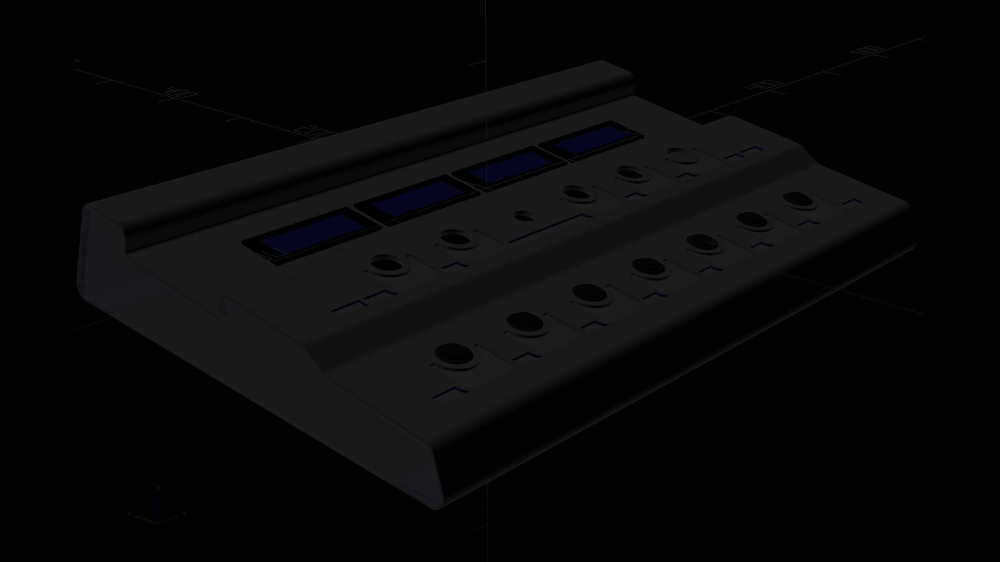

# DIY Pedal board

Welcome to my blog — a behind-the-scenes journey into the development of both hardware and software for a modern pedal
board.

## Introduction (project)

I know what you're thinking...

A pedal board? Really??
Aren’t there already a gazillion of them out there, ranging from €20 to €1000?

Fair point. Why building another one? <b>Because I can.</b> :-)

The longer answer? Most pedal boards out there suffer from limited or half-baked MIDI implementations.
They’re often designed just to send basic note or control messages, sometimes can’t even function standalone,
and typically come with button layouts that feel more like an afterthought than a tool designed for making music.
Why? Because traditional pedal boards were made for guitarists to add effects — not for musicians who want a real-time,
MIDI-capable control center.

So here’s the idea:
I’m building a <b>DIY MIDI MUSIC WORKSTATION PEDAL BOARD</b>.

Yes, it’s a mouthful — but it’s also going to be a powerhouse.

## Introduction (me!)

Who am I?

Hi, I’m Jens — a passionate software developer for over 30 years and a hobby musician when no one’s looking. 
This blog will be my space to document the build, share the journey, and dive into the many technical, musical, 
and design decisions along the way.
Expect breakdowns of the architecture, discussions about what works (and what absolutely doesn’t), 
and a few detours into the weird and wonderful corners of music tech.
Let’s build something ridiculous — and ridiculously fun.

---

## Expectation

### The Beginning (a.k.a. The Five-Year Think-Tank)

This project started — conceptually — about five years ago.
For a long time, it lived entirely in my head, evolving slowly, quietly, and occasionally waking me up at 3 a.m. with
brilliant ideas and equally terrible ones. Now, in May 2025, it’s finally taking shape in the real world. 
And oddly enough, it all began by finding a blogging
platform that didn’t make me want to rage-quit. Without that, I couldn’t share any of this with you.

Over the next few months, I’ll show how modern AI — yes, tools like ChatGPT — can accelerate progress, even when
you’re diving into a completely new programming language or toolchain. You’ll see how I use it as a kind of rubber
duck with a PhD and infinite patience.

### How I Start Any New Software Project

Whenever I enter a new field — or start a new software project — I always try to zoom out first.
I want a bird’s-eye view of the landscape:
What am I trying to build? What’s the end goal? How do the parts fit together? Who’s likely to rage against the MIDI
machine? Once I’ve got that overview, I start identifying building blocks — modules or parts that serve a clear, 
dedicated purpose. Then I break them down even further.

Why? Because just like in the real world, development has its own set of <b>golden rules</b>.

In everyday life, one such rule might be: 
<b>"Women are always right."</b> 
Or the more advanced version: 
<b>"No matter what you say as a man — no matter how carefully you choose your words — you’re always wrong."</b> 

In software development, our <b>golden rules</b> are a bit different (and slightly more forgiving):
- Separation of Concern
- Single Responsibility Principle
- Abstraction is Selective Ignorance

These principles help you stay focused as you break a complex system into manageable pieces.
Abstraction, for example, gives you permission to ignore certain details — for now — so you can tackle one part of
the problem without getting overwhelmed by the whole. But here’s the catch: as soon as you start thinking in components, 
you have to start thinking in interfaces. You need clear boundaries, defined responsibilities, 
and a structure that won’t collapse if someone sneezes near it.

---

## Breakdown

The following sections gives a brief overview about topics we have to deal with, from collecting requirements to 
creation challenges.


### Introduction: The Why
   As I hinted in the opening post, most existing pedal boards are missing features that should be considered basic
   by now. For example: 
   - Some midi devices can't operate standalone — meaning you need a laptop on stage just to make them useful.
   - They rarely support a full MIDI implementation — forget about proper SysEx handling or advanced message routing.
   - They offer little to no MIDI processing or translation — no filtering, merging, or dynamic manipulation.
   - They don’t support audio playback, like triggering WAV or SFZ files. 
   
   And the hardware? Often underpowered, with clunky UIs on postage-stamp-sized LCDs that feel like leftovers from
   a ‘90s microwave. I’m aiming to fix all that. 
   My version will include a touchscreen, modern UI, real processing power, flexible routing, sound playback, 
   and maybe — just maybe — that elusive "Make Coffee" feature in version 2. But let’s not get ahead of ourselves.


### Core Features (wishlist)

A modern MIDI pedal board should be more than just a button box with blinking lights.
At its core, it should be capable of sending any kind of MIDI message — from a simple note-on to full chords,
from CC messages to complex bank or program changes — all triggered by a single foot press. 
That’s the baseline.
Take my KORG Nanopad, for example. It can send control messages, sure. But you are limited in exactly which type,
nor can you choose when the message is sent — on press or on release. That limitation, unfortunately, breaks the MIDI 
flow with my KORG Kronos when it comes down to KARMA Scene switching.
To fix this, my pedal board will intercept incoming MIDI messages, and depending on the type or content, either:
- Transform them into something new
- Suppress them entirely (because some messages are better off forgotten)
- Route them selectively to specific outputs
- In later versions (maybe v3), I’d love to go further — like detecting chords and triggering DMX lighting scenes
  based on what’s being played. Because who wouldn’t want their chord progression to trigger a mini light show?

<b>Reactive Behavior and Display</b> 
This pedal board won’t just send messages — it’ll listen too.
It should be able to respond to Program Change messages from a master keyboard, switching patches or modes
on the fly. We’re talking two-way communication, not a one-way MIDI firehose. 
To support this, we’ll use a 7-inch touchscreen to show vital information such as:
- The current patch or preset
- An optional visual metronome
- Other status feedback, depending on the mode
- No more squinting at a cryptic two-line LCD or counting blinks.

<b>Sound Playback</b> 
To make this a real workstation-grade pedal board, it needs sample playback capabilities — not just control. 
The board will support triggering WAV and SFZ files, giving musicians the ability to fire off sound effects,
backing tracks, or even full instrument samples, all from their feet.

<b>Hardware</b> 
The button layout isn’t a traditional grid of rows and columns.
Instead, it mimics the shape of a piano octave — making it far more natural for playing notes and triggering chords,
especially for musicians used to thinking in keys, not coordinates. Furthermore: We're not using a Raspberry Pi 
here — surprise! 

The board runs on a full-fledged computer, capable of supporting:
- USB MIDI devices
- Network & WiFi communication
- Classic 5-pin DIN MIDI connectors
- 7 inch touchscreen (1024 * 600)

This hardware gives us the freedom and power to build a serious, extensible platform — one that musicians and
tinkerers alike can truly customize.



### Under the Hood: Software / Hardware Design and Tools

In this section, we’ll dig into the tools, languages, and design decisions behind the scenes — both digital 
and physical. I’ll walk through the programming languages and frameworks I’m using, and more importantly, 
why I chose them (spoiler: it’s not always logical — sometimes it’s just what compiles before midnight).
- We’ll get into the hardware-near stuff: low-level languages, how they interface with higher-level platforms like
  the JVM, and how to bridge the two worlds when your microcontroller and your main app don’t speak the same dialect.
- On the physical side, I’ll show the tools used to design and build the hardware:
  2D and 3D modeling tools, PCB design software (if it comes to that), and laser cutting workflows.
- The housing and metal case fabrication will get their moment too — including lessons learned while wrangling
  aluminum into submission.
- Expect lots of photos and diagrams from the build process: CAD designs, wiring spaghetti, soldering drama,
  and hopefully a few satisfying “before/after” moments.
- And who knows — we might even learn some hard truths, like how 220V really does hurt when you’re not paying
  attention.


   ---

## Final Thoughts
MORE TO COME

   ---
