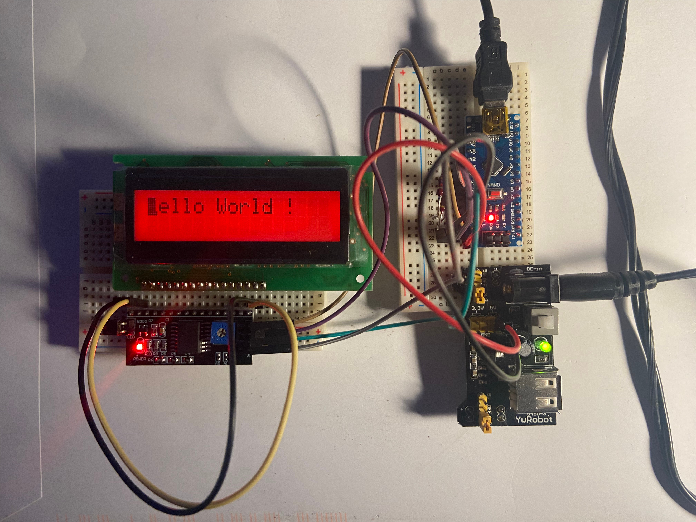

# Prototyping

> -- <cite>"The prefix prot-, or proto-, comes from Greek and has the basic meaning "first in time" or "first formed." 
> A prototype is someone or something that serves as a model or inspiration for those that come later. 
> The legendary Robin Hood, the "prototypical" kindhearted and honorable outlaw, has been the inspiration for countless 
> other romantic heroes. And for over a century, Vincent van Gogh has been the prototype of the brilliant, 
> tortured artist who is unappreciated in his own time."</cite>  
https://www.merriam-webster.com/dictionary/prototype

## Definition
In software development, a prototype is an early, simplified version of a software application or system that 
is built to demonstrate or test specific features, functionalities, or design concepts. 

We differentiate in:
- Throwaway/Rapid Prototype: Built quickly and discarded after use.
- Evolutionary Prototype: Refined gradually into the final product.
- Incremental Prototype: Built in segments that are eventually combined.
- Extreme Prototype: Common in web development — involves a static front-end and simulated services.

## Purpose
A prototype serves as a powerful tool for both customers and developers to gain a clearer understanding of what 
the final application / product might look and feel like. 
By providing a tangible representation early in the development process, it helps communicate ideas more effectively, 
uncover potential misunderstandings, and validate key design or technical decisions. 
This early visibility allows stakeholders to better estimate risks, costs, and development efforts, 
ultimately leading to more informed decisions and reduced chances of costly rework later on.

##  Key Characteristics

- Incompleteness: It often lacks full functionality or robustness.
- Exploratory: Focuses on trying out ideas quickly rather than perfect execution.
- User-Focused: Helps gather user feedback early in the development cycle.
- Iterative: Typically refined through multiple iterations based on stakeholder input.

## Mocking

Mocking components in a prototype is generally acceptable when dealing with well-understood, 
low-risk elements like databases, message brokers, or authentication systems — especially when these components are standard, 
off-the-shelf, or pose no real uncertainty. In such cases, mocking can accelerate development without introducing significant risk.

However, it becomes problematic — and should explicitly not be allowed — when used to bypass components that 
are technically uncertain, novel, or high-risk. These include:

- Custom or unproven hardware integrations
- Complex algorithms or models with unknown performance
- Real-time data processing pipelines
- Third-party systems with unclear interfaces or behaviors

Mocking these uncertain parts hides potential risks, leading to inaccurate cost, timeline, or technical estimates. 
A prototype intended to inform feasibility, architecture, or project planning must engage with these areas directly 
to uncover the true challenges early.

----

The following sections provide an overview of different prototyping areas — both in software and hardware.

On the software side, I’ll walk you through simple, easy-to-understand examples (available on GitHub) that
illustrate core concepts. Each of these samples plays a fundamental role in its own dedicated section.

[C++ and Arduino? Overview](/arduino) 
[C++ and Arduino? From delay(), Tasks, I²C and LCDs](/arduino/i2c) 
[Java, JavaFX LCD Simulator?](/prototyping/simulation) 

And while they may start out as isolated experiments, rest assured:
every one of them contributes to the final product in some way.
